# test-plano-beneficiario
# Avaliação #

# Desenvolvedor Backend Java #

### Autor / Responsável do Projeto: ###
#### Alexandre Mendes de Freitas

> ### Status: ### 
> #### Concluído, incluído todos os testes unitários realizados e atualizados no GitHub.

> ### Objetivo: ###
> Criar uma aplicação para cadastro de beneficiários, que poderá conter uma relação de documentos diferentes, para cada beneficiário cadastrado, seguindo a especificação. 

> ### Descrição do Projeto: ###
> Este projeto, apesar de ser experimental, consiste na implementação de um microserviço, que compreende o processo de cadastro, alteração de dados e exclusão de beneficiários, incluindo documentos, que podem ser, de tipos diferentes, que podem ser adicionadas a quantidade de documentos relacionadas para cada beneficiário, válidos também para alteração e exclusão de dados.

### Funcionalidades e Demonstração da Aplicação: ###
#### O funcionamento desta aplicação é feito da seguinte forma: ####
#### As ações aplicadas durante o desenvolvimento foram as seguintes: ####

##### Primeiro Passo: Organização das packages #####
Verificar, dentro do contexto, quais são as packages que precisam ser criadas, para critérios de organização, além de especificar sua devida funcionalidade para a regra de negócio específica a ser utilizada para a aplicação. Elas foram definidas como:
+ controller
+ domain
    + beneficiario
    + documento
    + endereco
    + usuario
+ infra
    + exception
    + security
    + springdoc
##### Segundo Passo: Criar a classe BeneficiarioController #####
Nessa classe, foram criados todos os métodos necessários para atenderem as principais necessidades solicitadas na especificação para a regra de negócio, seguindo as regras do CRUD. A partir dessa classe foi iniciada o processo de criação da JPA, seja da classe Beneficiario, o mesmo vale para a classe Documento.
Nela, foi definida a criação do endpoint, definida em inglês e no plural (beneficiaries), utilizando as anotações @RestController, para indicar que é uma classe controller para ser chamada dentro do contexto, @RequestMapping, onde contém o endpoint criado em questão e a anotação @SecurityRequirement, que corresponde ao requerimento de segurança ao carregar a documentação do Swagger no momento que o usuário carregar o token de segurança, que será visto mais adiante.

##### Terceiro Passo: Criação das classes JPA e seus relacionamentos #####
Neste passo, foram criadas as classes Beneficiario e Documento, sendo que a primeira classe precisa fazer o relacionamento (1..n) com a segunda, conforme a documentação:
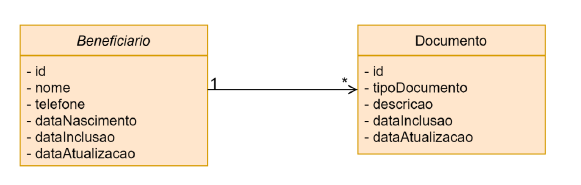
Para isso, foram utilizadas as dependências abaixo, primeiro, pensando na criação das classes JPA, segundo, na criação das tabelas, utilizando o Flyway DB e depois o H2, para a criação do banco, configurando em seguida, no application.yml, as configurações para conectar no banco.

Dependências:

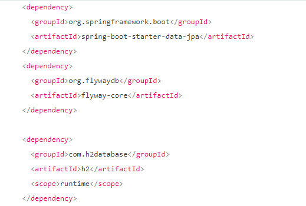

Finalizando este passo, foi criada a package "db.migration", acompanhada do primeiro script, para ser executada no Flyway. Lembrando que a aplicação deverá estar parada enquanto estiver configurando. Quando terminar, subir a aplicação novamente, iniciando a console do H2, utilizando as configurações locais
Dados:
+ URL: http://localhost:8080/h2-console
+ Driver Class: org.h2.Driver
+ JDBC URL: jdbc:h2:mem:plano_api
+ User Name: sa
+ Password:

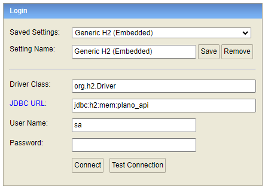
OBSERVAÇÃO: Clicar em Test Connection para verificar se a conexão foi feita com sucesso. Se sim, clicar em Connect.

##### Quarto Passo: Iniciar os testes dos cenários criados no Insomnia #####
Ao inicializar a aplicação, será necessário criar no Insomnia, todos os cenários necessários para serem aplicados ao processo relacionado a criação de Beneficiario e Documento (já relacionados), incluindo alteração, remoção, analisados e solicitados pelo responsável do projeto.
Para isso, deverá seguir os seguintes passos:

1. Inicializar a aplicação local;
   
   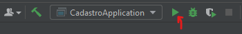
2. Inicializar a console do Banco de Dados H2;
   
   
3. Com a console aberta, digitar os dados abaixo:
   insert into usuarios values(1, 'user.test@plano.saude', '$2a$12$yzLtyHK3No4YADcI.r5n/OO/hAxc.DRfH9M08cd0QcYFUBWJi8huG');
   select * from usuarios;
   
   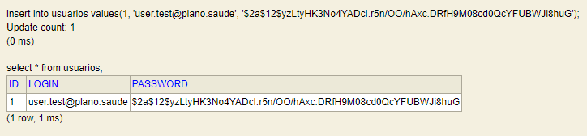
4. No Insomnia, criar uma requisição do tipo POST, com a URL: http://localhost:8080/login. Na aba Body, selecionar a opção JSON e clicar abaixo, para montar o corpo da chamada, igual ao exemplo. Feito isso, clicar no botão Send. Com o token gerado, copiar o conteúdo que está dentro das aspas duplas.
   
   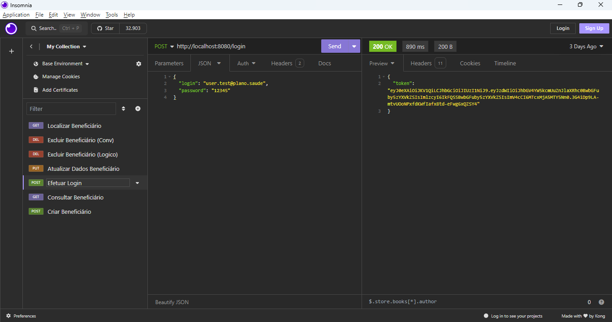
5. Após copiar o token no item anterior, o próximo passo é Criar Beneficiário, pelo Método POST. Lembrando que se não colar o token antes da chamada, será retornado o erro abaixo. Do contrário, o beneficiário será criado com sucesso, junto com o documento relacionado.
   
   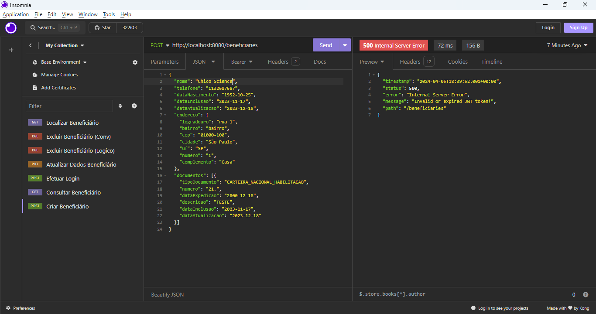
   
   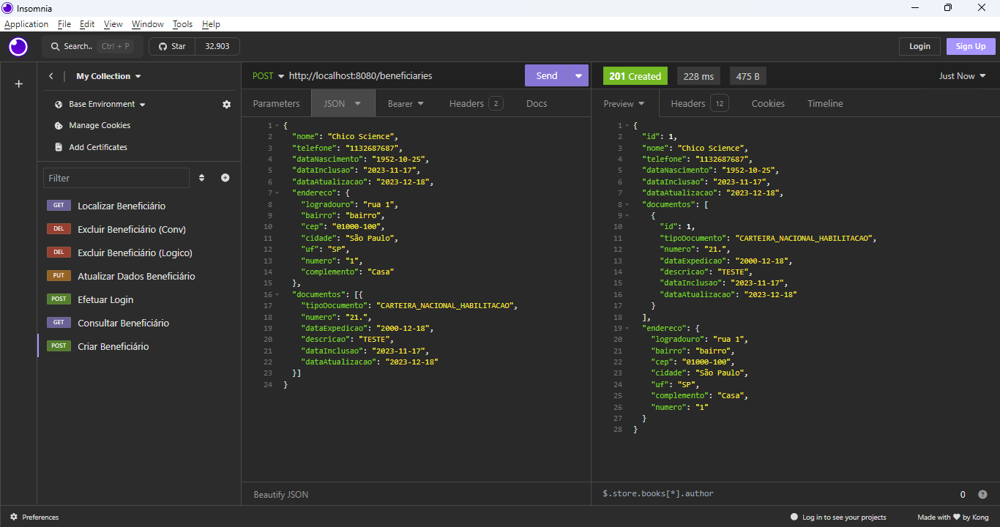
6. Consultar beneficiários 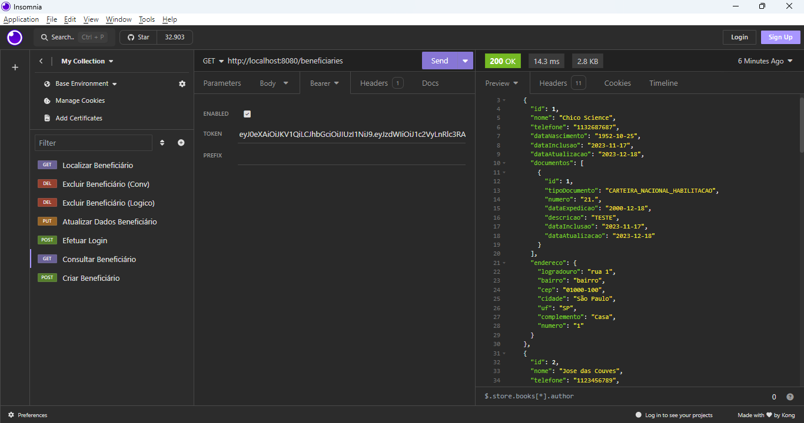
7. Consultar beneficiários por id 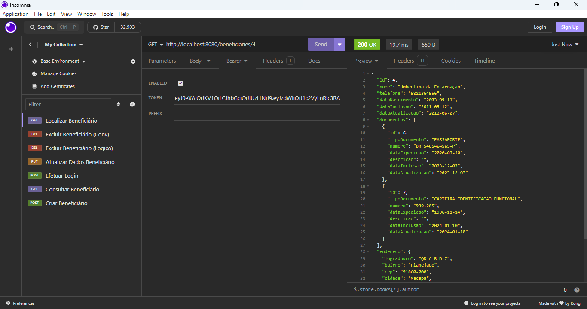 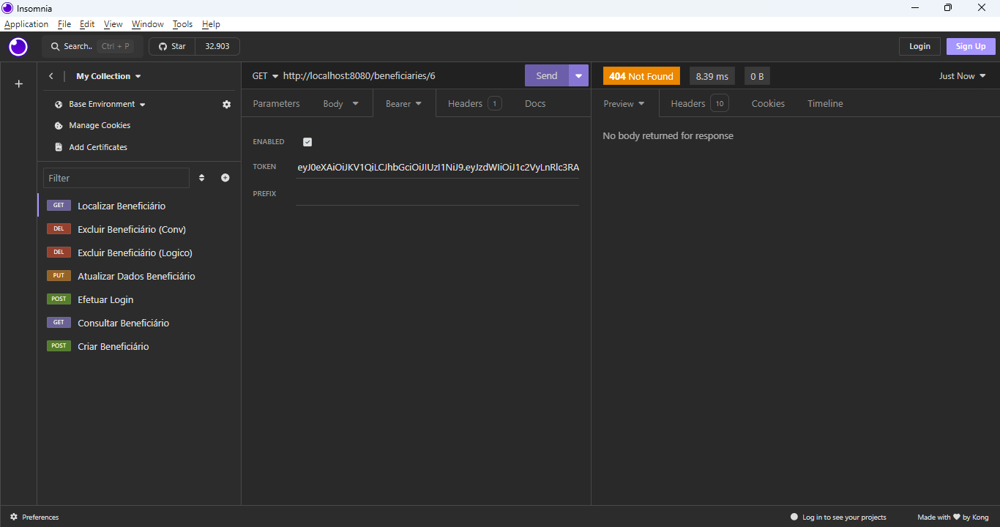
8. Alterar dados do beneficiário 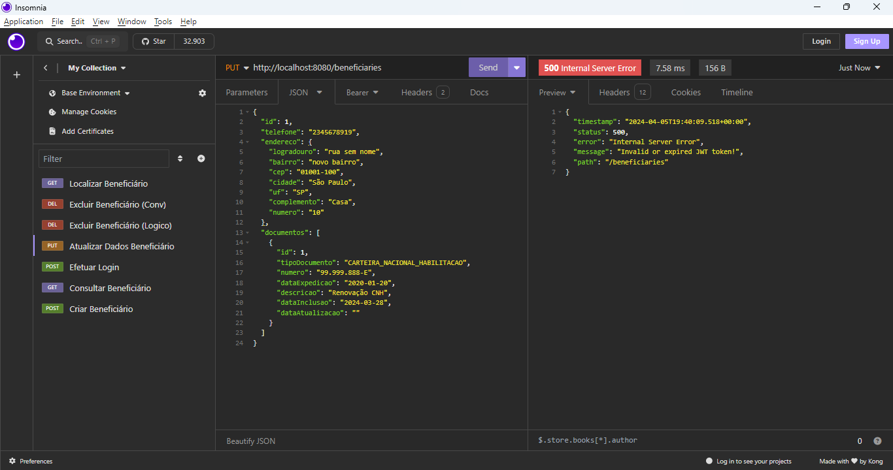 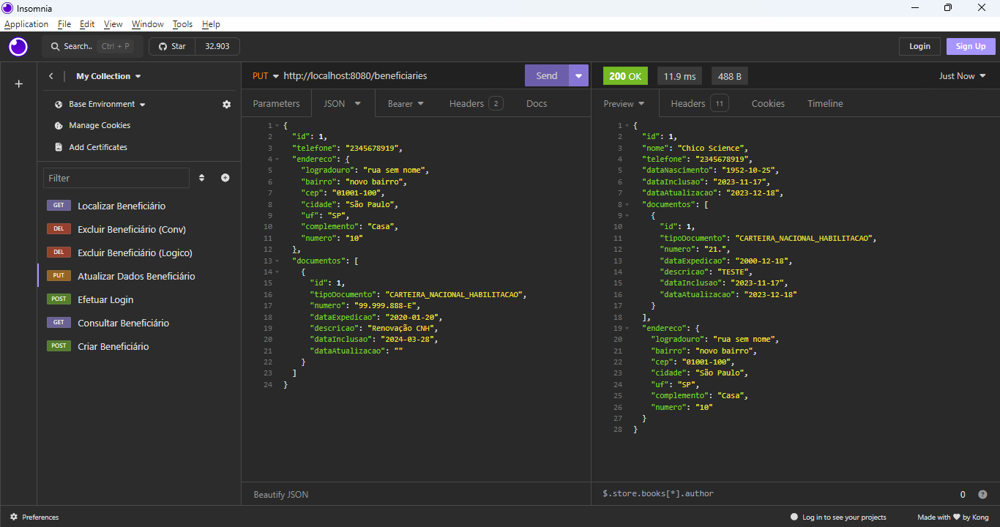

OBSERVAÇÃO: Para cada tipo de chamada de método a ser chamada pelo Insomnia, o usuário deverá configurar o token, que no caso, será válido por duas horas, devido a configuração que fora definida no código para expiração, explicada anteriormente. Passado este prazo, deverá gerar um novo token e repetir o processo.

Próximo passo será como mostrar os processos de remoção de beneficiário criados, que será visto no Quinto Passo, como foi aplicado na ordenação, durante o processo de desenvolvimento e testes da aplicação. Antes disso, é possível exibir o resultado das tabelas beneficiario x documento para comparar o resultado final após as alterações. Atualmente, as tabelas encontram-se com este retorno:

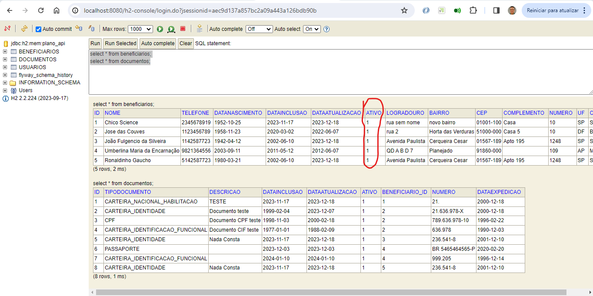

Estejam atentos com a coluna ativo, na evidência. Isso comprova, por enquanto, que todos os beneficiários estão ativos no momento da consulta até aqui.

##### Quinto Passo: Formas criadas na aplicação adotadas para remover um beneficiário #####
Na documentação foi solicitada para remover um beneficiário, porém, não foi exatamente especificado como devemos remover. Este processo foi criado na aplicação por duas formas diferentes, uma, pelo método convencional, pelo simples ato de remover um beneficiário e todo o conteúdo que o acompanha do Banco de Dados, sem ter como recuperar. A outra opção, talvez a mais viável, caso o beneficiário deseja retornar para o plano, ser mantido na base, não é removido, mas sim, inativado, alterando seu "status", permitindo que permaneça seus dados cadastrados no Banco, permitindo que sejam reativados, quando necessário.
Na primeira opção, como podem observar, foi criado, partindo do endpoint raiz, originário do controller, mapeando do "id" que desejamos fazer a remoção do Banco de Dados, via repository, mapeado pelo método 'deleteById', cuja operação transacional, que, ao passar o id desejado, o usuário irá remover diretamente o dado selecionado, com retorno 204, previsto no HTTP, após a chamada.

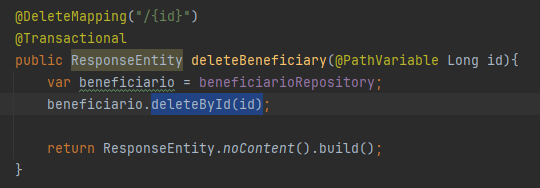

Já na segunda opção, para diferenciar, foi colocado com endpoint um pouco diferente "/deletelogicId/{id}", também informando o id para "remover" este beneficiário do Banco. Só que antes disso, na tabela beneficiarios, foi criado um script para adicionar uma coluna 'ativo', do tipo tinyint, do tipo inteiro, para o SQL e no Java, na classe JPA, mais precisamente, também foi adicionado o atributo, mas do tipo Boolean, ou seja, será interpretado como 0, se for cancelado (ou removido) e 1, permanecendo ativo. Nesse caso, após subir a aplicação e executar os dados atualizados até aqui, pensando em remover o beneficiário, será retornado o código 204 - No Content, configurado como padrão do HTTP para este cenário, compreendido como remoção. Porém, quando consultar os dados no Banco, serão observados que todos os dados cadastrados permanecem na base, com a diferença a coluna "ATIVO", após efetuar uma consulta no Banco de Dados, será verificado que esta coluna irá retornar "0", que corresponde a valor falso, removido, por teoria.

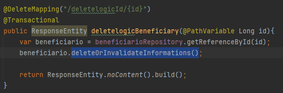

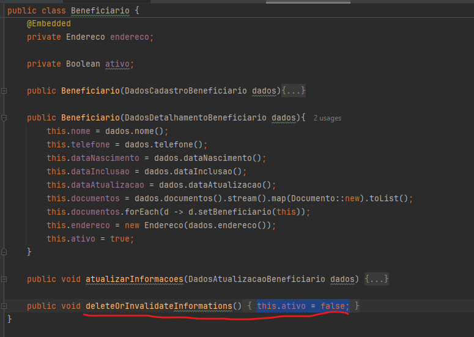

Seguem as evidências dos retornos dos testes, seja via Insomnia ou via Swagger (incluindo resultados da nova consulta no Banco) para comprovar o funcionamento da remoção de beneficiários, independente dos métodos oferecidos:
Método Delete (Direto/Convencional):
+ Insomnia
   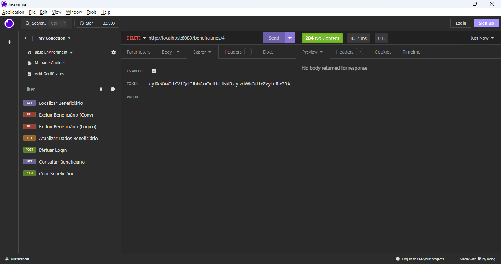
+ Swagger
  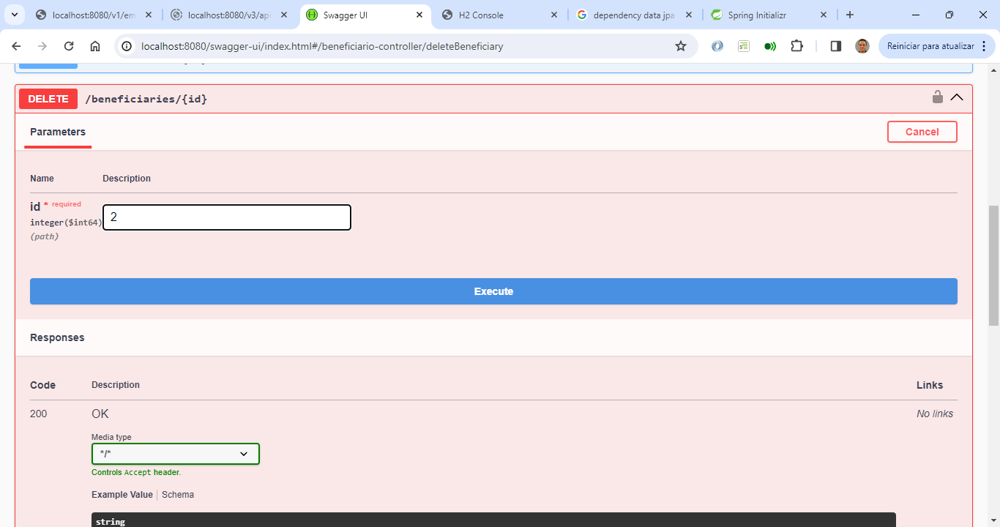 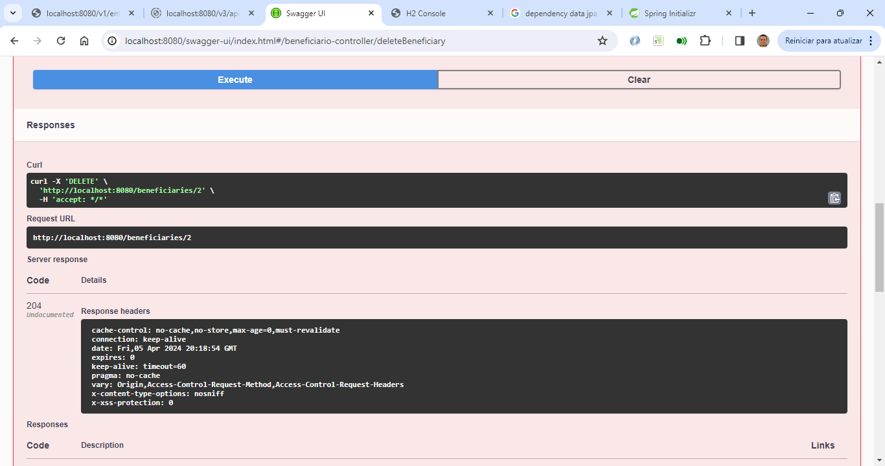

Método Delete (utilizando o tratamento "ativo"):
+ Insomnia
  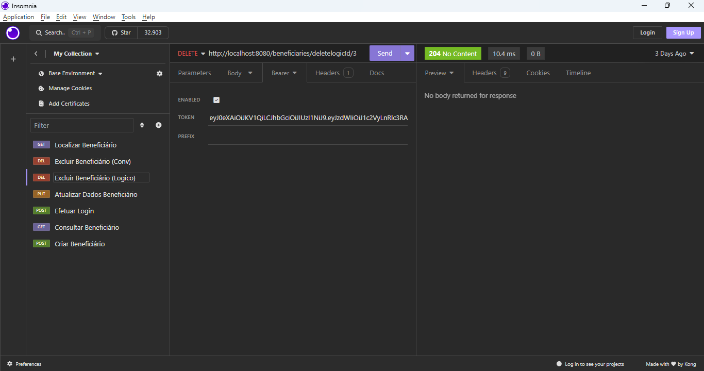 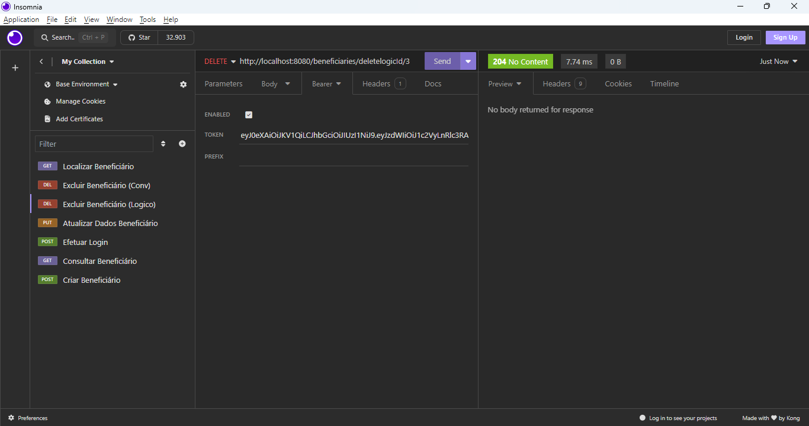
+ Swagger
  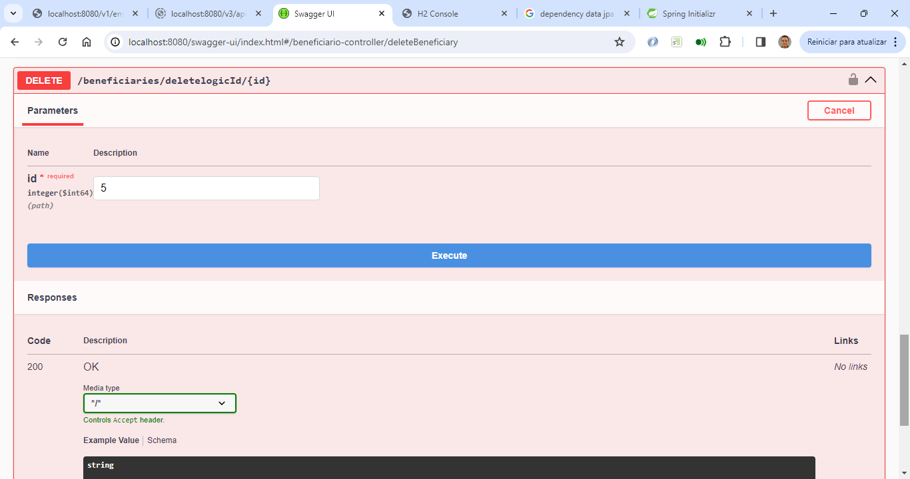 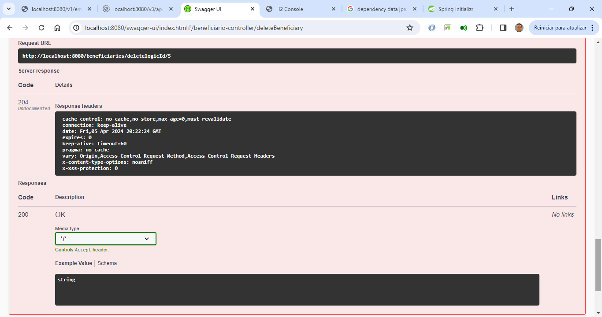

**Retorno Banco H2**
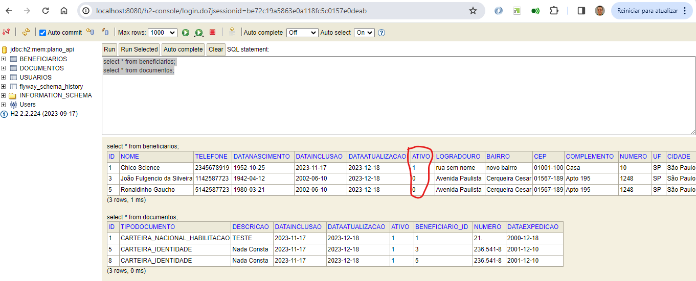

**SOLUÇÃO:** Logo, os beneficiários que foram submetidos a remoção convencional, não estarão no banco, foram removidos, que foram os registros com id 2 e 4. Agora, removendo beneficiários, utilizando o tratamento ativo, somente para invalidação na base, os registros com id 3 e 5 permanecem no Banco, mas com ativo igual a 0, considerados **INATIVOS** para a base, em outras palavras ou técnicas para o negócio, canceladas ou removidas.

##### Sexto Passo: Adicionar a dependência para documentação Swagger, incluindo configuração JWT e processos para testes #####
Para utilizar a documentação Swagger, seja para efetuar testes, garantir documentação, para efeitos de qualidade ou efetuar testes da aplicação, poderá utilizar o Swagger, seja da forma tradicional, seja da forma segura que o usuário necessita acessar, através de token.
Visitar o site https://springdoc.org/ para tutorial, carregar a dependência, no caso copiar e colar no pom.xml, assim como ser feita também para copiar e colar a dependência:

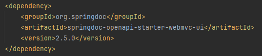

O mesmo processo também se aplica para efeitos de utilização da documentação voltada para as regras de negócio, estabelecidas e definidas na classe BeneficiarioController.

Processo passo a passo, para utilização do Swagger:
1. Inicializar a aplicação local;
   
   
2. Inicializar a console do Banco de Dados H2;
   
   
3. Com a console aberta, digitar os dados abaixo:
   insert into usuarios values(1, 'user.test@plano.saude', '$2a$12$yzLtyHK3No4YADcI.r5n/OO/hAxc.DRfH9M08cd0QcYFUBWJi8huG');
   select * from usuarios;
   
   
4. Acessar o Swagger http://localhost:8080/swagger-ui
   
   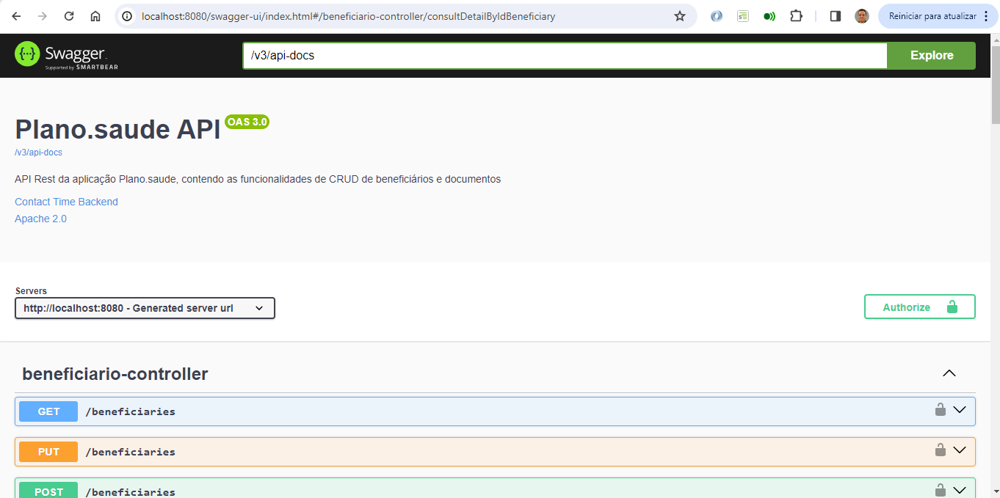
5. Gerar token em '**autenticacao-controller**', clicando em _Try it out_, informando o login e password cadastrados no banco, igual como fazia na chamada no Insomnia.
6. Informar (colar) o token gerado
   
   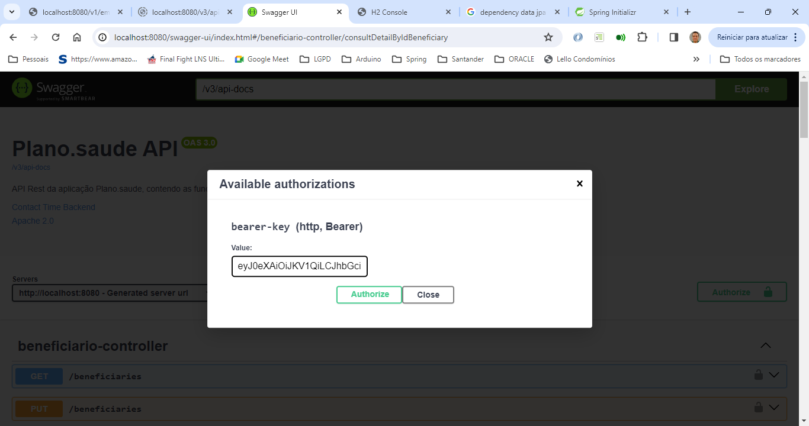
7. Criar beneficiário em '**beneficiario-controller**', clicando em _Try it out_, informando os dados necessários para montar a requisição para a criação do beneficiário.
   
   
   
   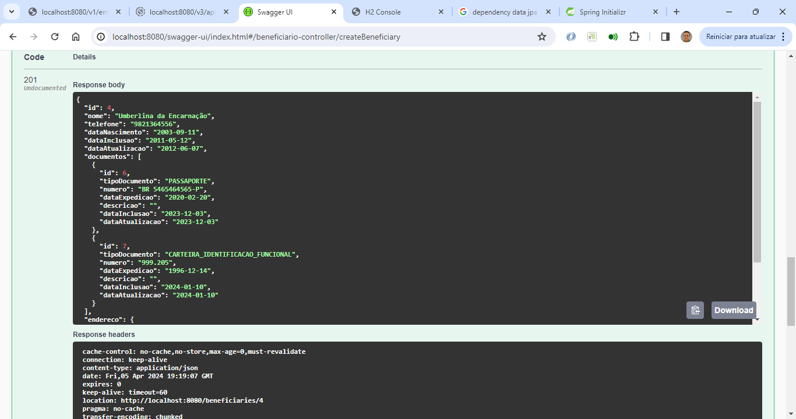
8. Consultar beneficiário 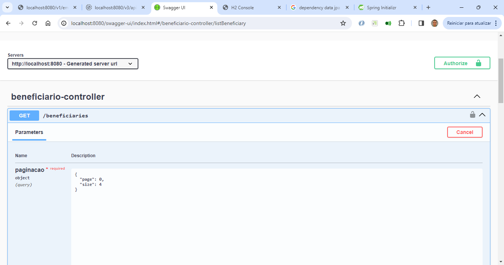 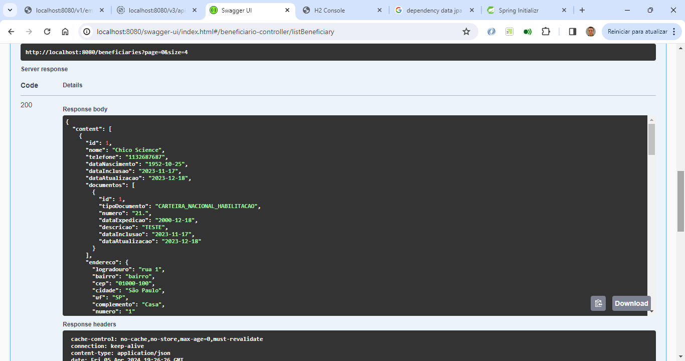
9. Consultar beneficiário por id 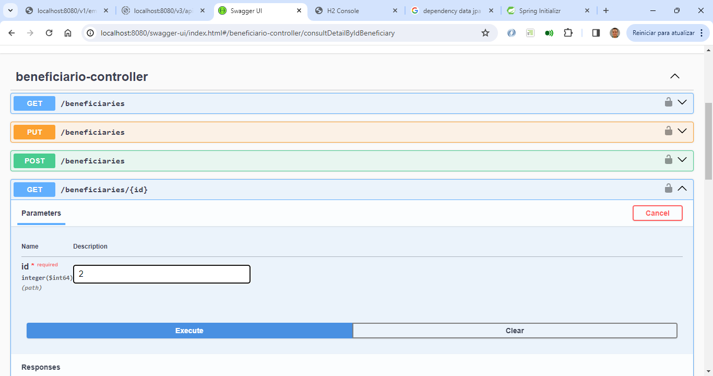 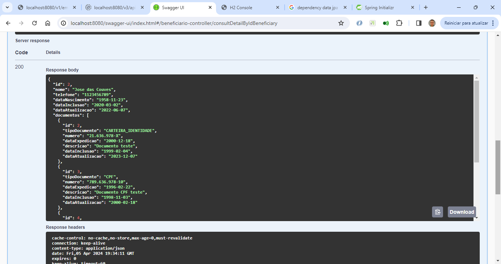
10. Alterar dados beneficiário 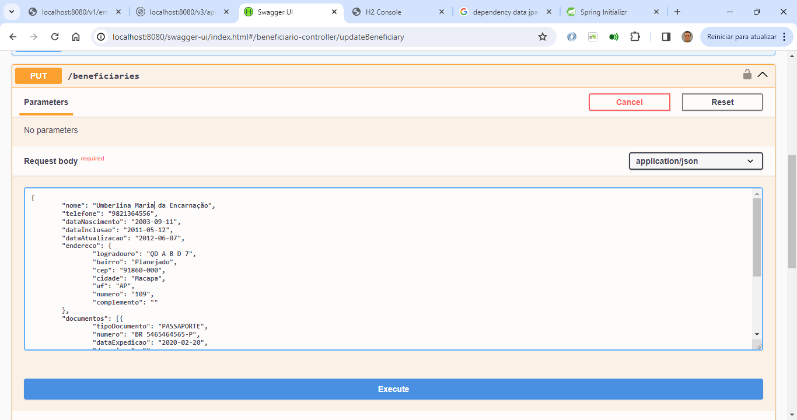 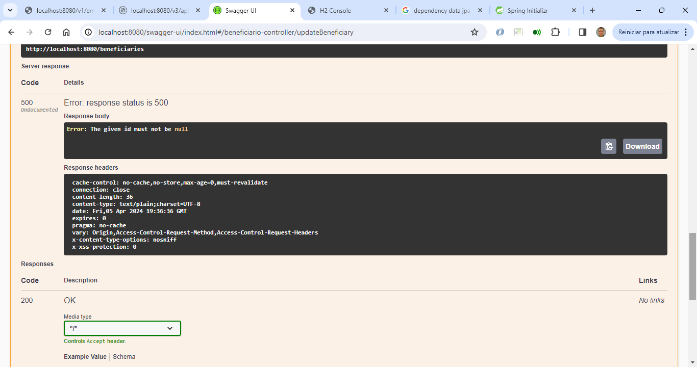 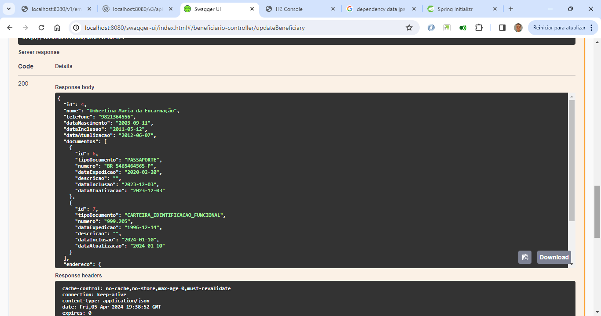

OBSERVAÇÃO: No Swagger, o processo é diferente do Insomnia, o usuário clica em Authorize, em Value, será colado o token gerado, também, com validade de duas horas, devido a configuração que fora definida no código para expiração, explicada anteriormente. Passado este prazo, deverá gerar um novo token e repetir o processo. A vantagem é que, fazendo pelo Swagger, por este processo, todas as requisições que aparecem com o cadeado estarão liberadas, sem haver a necessidade de informar o token repetidas vezes.
OBSERVAÇÃO 2: Os procedimentos para excluir um beneficiário via Swagger, procedem com os mesmos passos explicados no passo anterior.

##### Link Api-Docs #####
http://localhost:8080/v3/api-docs

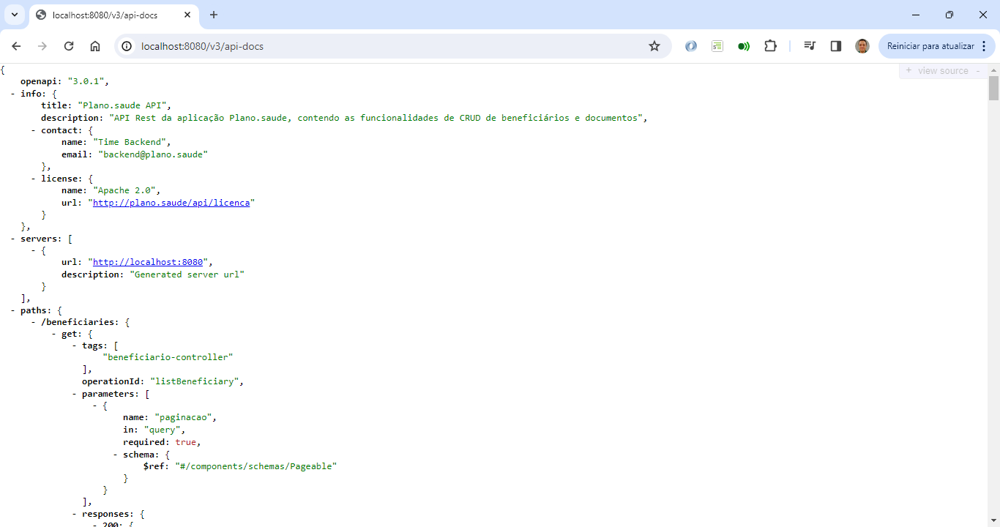

### Acesso ao Projeto: ###
#### Passo 1: ####
Para fazer as chamadas de todas as operações envolvendo beneficiários na aplicação, o usuário deverá cadastrar no Banco de Dados, mais precisamente, na tabela Usuario, informando os campos "login", que corresponde ao e-mail e password, informar uma senha.
Evidente que a senha não deverá estar visível, tanto no código via back-end, como no banco. Ao criarmos os dados via SQL, utilizei como exemplo, o valor "12345", que é visível. Para mascarar este valor, foi utilizado o bcrypt, para geração da encriptação da senha do usuário para cadastro.
Exemplo:

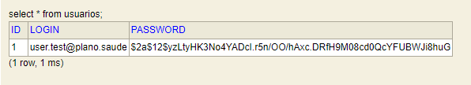

#### Passo 2: ####
Adicionar as dependências abaixo no pom.xml:

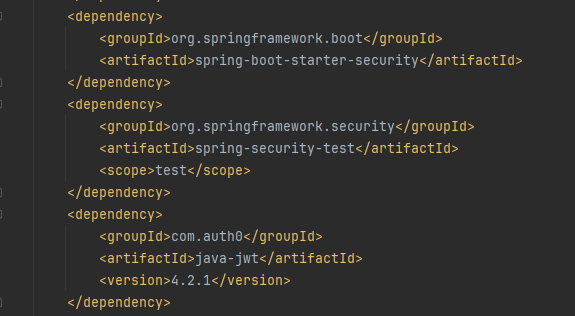

#### Passo 3: ####
Criar a classe AutenticacaoController, para enviar o token e fazer os tratamentos de autenticação de segurança nas classes TokenService e DadosTokenJWT, criados na package security.
Nela, é criada apenas um endpoint ("/login"), antes de utilizar qualquer recurso desta aplicação, terá acesso livre, se tiver usuário cadastrado no Banco de Dados para gerar token e autenticar sua permissão.
A classe AuthenticationManager é importada do Spring para gerenciamento, quando o usuário valida os dados tanto pelo Spring, como pelo fluxo da aplicação. A classe TokenService serve para criar o JWT e validar o tipo de
algoritmo criado, para cada usuário cadastrado. No código, também é possível identificar o usuário que efetuou o login e por quanto tempo o token permanece ativo, no caso, foi configurado para ser validado durante duas horas,
utilizando o algoritmo HMAC256. Do contrário, funcionando algo diferente, seja para criação ou para verificação do JWT, será lançada uma exceção e retornada para o usuário, durante a chamada.
Foi criado um método POST, recebendo um DTO (Data Transfer Object), no caso uma classe record, para o Spring 3, a classe DadosAutenticacao, passando os atributos login e password, respectivamente.

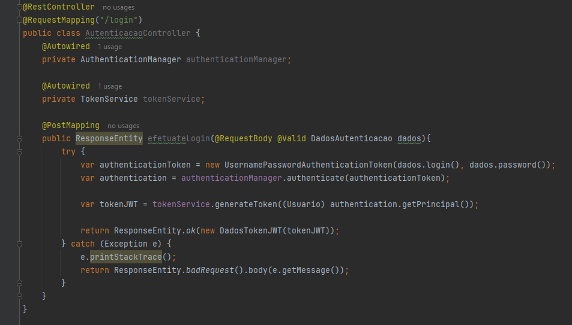

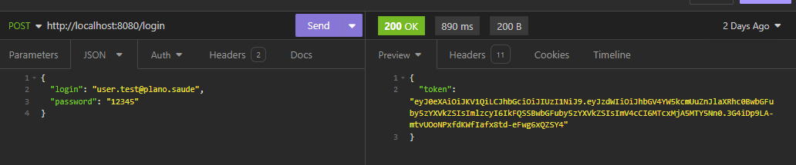

#### Passo 4: ####
Criar a classe JPA Usuario, implementando da classe UserDetails (configurada na interface UsuarioRepository, para localizar pelo método 'findByLogin'), do Spring, informando o nome da tabela e da entidade. Nos métodos que a acompanham nesta classe, foram aplicadas as configurações que determinam os acessos padrões para definições de usuário, senha e autorizações.

### Tecnologias utilizadas: ###
> + Java 17;
> + Spring Boot 3;
> + IDE - IntelliJ IDEA;
> + Paradigma de Orientação a Objetos;
> + Banco de Dados H2;
> + Flyway DB;
> + Spring Security;
> + JWT;
> + Swagger;
> + GitHub;
> + Insomnia

### Licença: ###

### Conclusão ###
##### A construção da aplicação foi concluída, mostrando como pode ser desenvolvida, através do documento informado, todo o processo necessário, através dos requisitos e das regras de negócio, como efetuar o desenvolvimento simples de um microserviço backend, exibindo o relacionamento entre tabelas, a criação de dados entre elas, incluindo, alterações e tipos de exclusão (apenas de beneficiários) que podem ser apresentados, dentro da especificação, provavelmente, previstos, com requisitos básicos para funcionamento do fluxo. #####
##### Porém, foram observados alguns pontos que não faziam sentido dentro do contexto solicitado, que precisavam ser adicionados (ou talvez ajustados, para adequação), para fazer mais sentido a regra de negócio. Com isso, houveram adaptações no desenvolvimento da aplicação, caso o escopo seja estendido para uma nova atualização, sempre previstas após a construção da aplicação. #####
